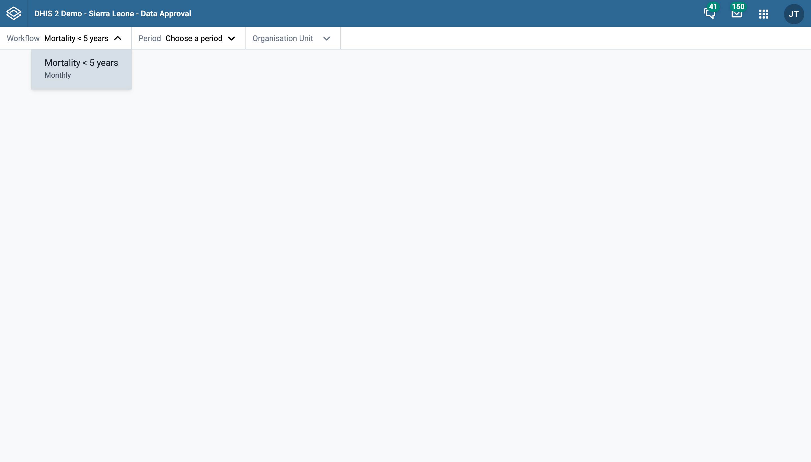
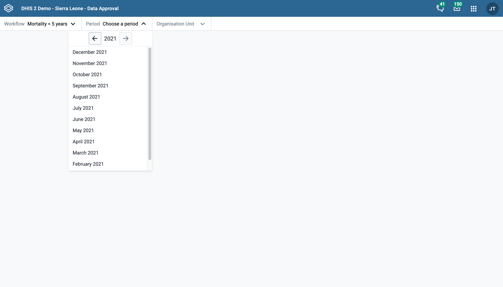
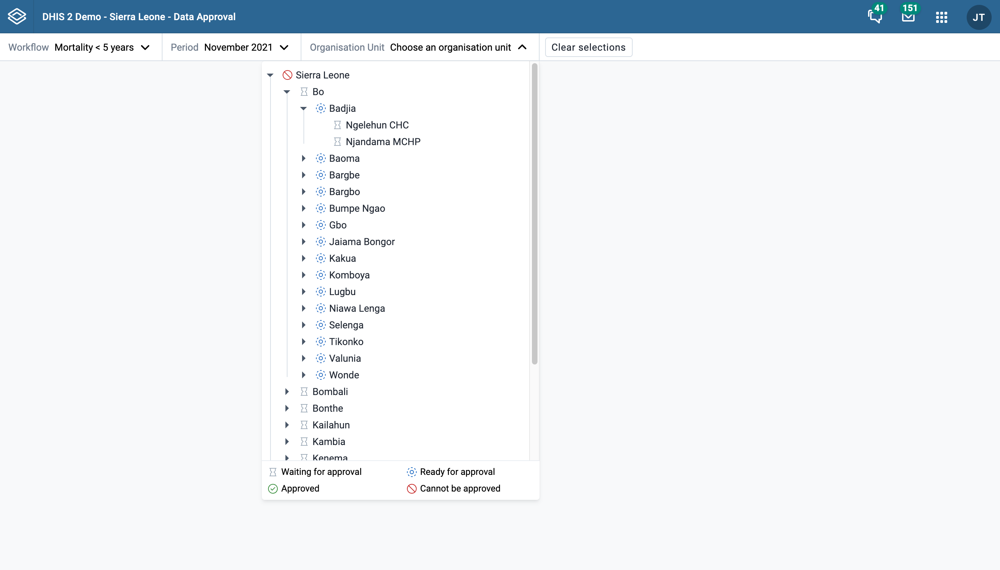
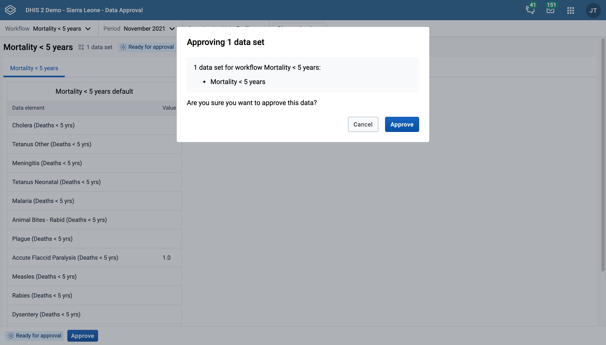
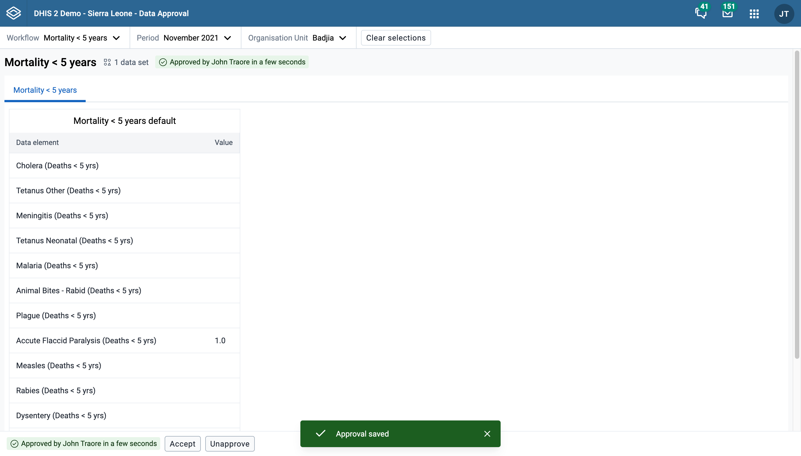

# Approving by workflow { #approving_by_workflow }

## Selecting data

### Select a workflow

Start by selecting a workflow in the top left of the screen. If you only have access to a single workflow, it will be preselected for you.

### Select a period

Then proceed to select a period you would like to approve data for.

### Select an organisation unit

Finally, select an organisation unit you would like to approve data for. Each visible organisation unit in the tree is preceded with a status-icon. This icon serves as an indication of the actions available to your user profile for that organisation unit. In the screenshot below, "Badjia" is an organisation unit with status "ready for approval".

### Clear selection

Once a workflow, period, and organisation unit have been selected, a "clear selections" button will appear. This button can be used to quickly clear all three fields and start a fresh selection.

## Approving data

### Review dataset reports

Once a workflow, period, and organisation unit have been selected, you can review the dataset reports for the datasets connected to the selected workflow. The data for each dataset is presented in a tab.

Datasets can have different period types than the workflow the are connected to. If this is the case, the approval app will show data for all the dataset-periods that end within the selected workflow period.

### Take an approval action

Once you have reviewed the data in the datasets, you can proceed to take an approval action. The following actions are available:

-   Approve
-   Accept
-   Unapprove
-   Unaccept

Which of these actions are available for a given workflow at a given moment in time depends on the type of actions which have been taken already at the current and other levels of the organisational hierarchy.

In the example above the "approve" action is available. When you choose the "approve" action, you are presented with a confirmation dialog as displayed below which summarises the datasets you are approving. The workflow is not approved until you click "approve" to confirm there. Other actions take effect immediately and do not have a confirmation step.

After taking one of the approval actions, in this case after confirming the approval, the workflow is updated immediately and you see a the new approval status.

### Approval status tags

As shown in the image above, the approval status is displayed in two places:

1. Above the dataset tabs, after the workflow information
1. Before the buttons on the bottom bar

These status tags may not always display the same information, because the have a slightly different meaning:

1. The status tag above the dataset represents the approval status of the workflow for the selected period and selected organisation unit
2. The status tag in the bottom bar does the same, but also takes your user profile.

Perhaps a workflow is ready to be approved at a given organisation unit level, but you do not have the appropriate authority to do so.
